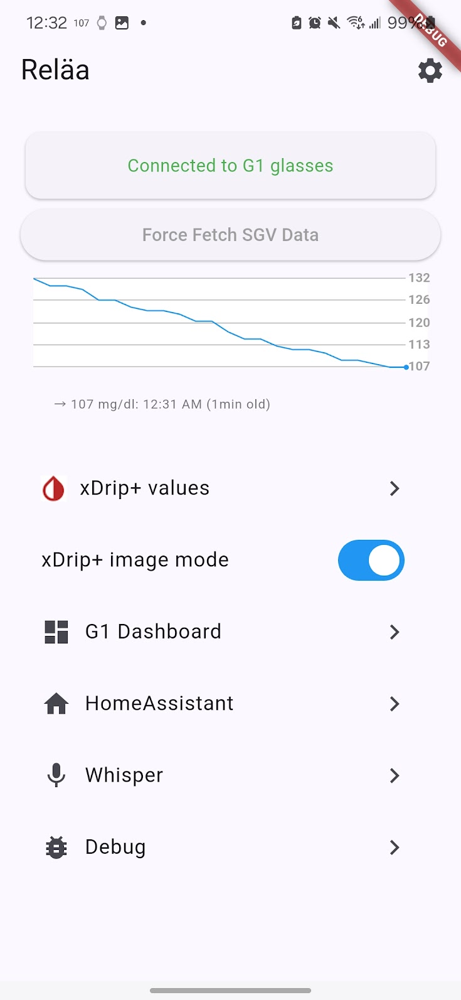

# Reläa

Reläa aspires to share xdrip+ data via Local Broadcast to the Even Realities G1 smartglasses. Forked from fahrplan.

This is WIP, the readme (in main) will be updated when a usable version is ready.

| Theme | Dark    | Light |
| -------- |---------|-------|
| |  |   |

## Installation
Download this code branch, and either compile it in Android Studio, or via `flutter build apk`.

## Roadmap
As this feature branch approaches stability I will put together a more complete roadmap of what features I plan to work on.
This is a garden project right now, I am maintaining it for my own personal use. If it is useful to others that is great.
If you need a feature, feel free to reach out and we can talk through if it is something I believe I can implement, 
or how you can contribute to help me accomplish it.
Device testing, I have very limited device access to test on a range of hardware but I will try to look into any issues you find in testing.

Tentative roadmap: 
- Better support for image/graph of glucose values to the glasses (There are some artifacts in teh BSP output being sent to the display). I want to support only "alert on change" like we can for text.
- Better support for text based values being sent to the glasses (There is a newer API from Even that is more reliable). I want to support "always on" text like I can for images.
- Better support for not showing stale data.
- Support other data consumption from xDrip (local broadcast)
- Support other data consumption from Even Realities G1 headset (Gadgetbridge for battery health)
- Support alternative software for the G1 like AugmentOS.

###
Risks:
This is a _feature branch_. It is not tested fully, it is not released. Use it at your own risk.

Will you distribute apk files some day? Maybe, it's not part of the short term plan.
What devices have you tested this with?
   - Dexcom G7 sensors (US) with Dexcom configured for mg/dl
   - xDrip+ connected to the Decom app (modified for local broadcast)
   - Android 14 on a Samsung S22

Forked from [Fahrplan](https://github.com/meyskens/fahrplan/tree/main)

"Reläa" is a Swedish word for electrical relay which is the extent of what I want to accomplish with this garden project. I want an application that can easilly forward glucose data from a users xdrip+ phone to the Even Realities headset so the user can know their glucose at a glance.

While it is meant to offer an "OS" for the Even Realities G1 and will copy some of the original functionality like notifications it is not designed to be a full smartglasses OS.

## Why the G1 specifically?

Simple: they are the only glasses with display that fit my face and are able to ship my prescription. That's it.

## Supported OSes?

- Android (primary development)
- iOS (probably works in simple tasks, notifications and permissions will need work!)
- Linux will not work: experiments have been done with Bluez but BLE notifications are buggy, sorry

## Thanks
Thanks to @emingenc and @NyasakiAT for their work in building the G1 BLE libraries
- https://github.com/emingenc/even_glasses (The most complete library!)
- https://github.com/emingenc/g1_flutter_blue_plus/tree/main (The foundations for the Dart implementation)
- https://github.com/NyasakiAT/G1-Navigate (Further development of the Dart implementation and BMP composing code)

## Copy me!

As mentioned above this is already a forked project. If any of this is useful to you copy it.